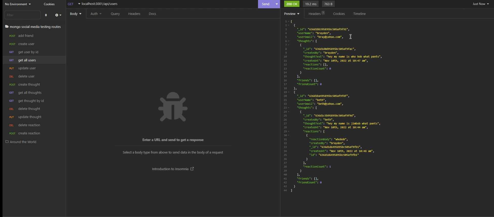

### License: , (https://opensource.org/licenses/MIT)

# Title: Social Network API
## link to walk through video
https://drive.google.com/file/d/1gqnTfuLzzJhlxbj5ro95gjClQaFzM_UP/view?usp=share_link

## Screenshot

## Description:
This app uses MongoDB and Mongoose to create a backend server with api routes for a social media start up.
## Table of Contents:
* [title](#title)
* [Description](#description)
* [Table of Contents](#table-of-contents)
* [Installation](#installation)
* [Usage](#usage)
* [License](#license)
* [Contributing](#contributing)
* [Testing](#testing)
* [Questions](#questions)
      
## Installation: 
To see this app in action pull it to your local machine, run "npm  i" to get the required packages, then run "npm start" to fire up the server.

## Usage: 
since this is backend only, the only way to test these routes is through insomnia.
## Licensing: This application is covered under MIT License.

## Contributing: 
feel free to contribute
## Testing Instructions: 
testing was done through insomnia
## Questions: 
ask away!
Contact Me:

Github: https://github.com/banjosquash

Email: braymcmahan@yahoo.com
